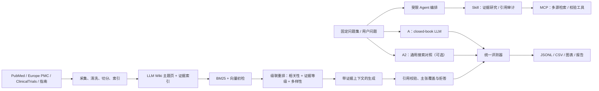

# OpenEvidence MVP：赛道 1 与赛道 3 实施规划（审阅稿）

> 版本：v0.5（2026-08-11）
> v0.5 修订：统一人工盲评口径为 P0；修正 E 条件候选集表述；补充版本约定与题型映射说明；删除未定义的“12 题方案”引用。
> 适用范围：3 天实践项目；赛道 1、赛道 3 各 6 人，共 12 人  
> 当前状态：仓库只有需求资料，尚无代码、依赖、测试或数据，需要从零搭建  
> 范围说明：本规划只覆盖课程三赛道中的赛道 1（临床证据助手）与赛道 3（专用 AI vs 通用大模型对比评估）；赛道 2（健康营养助手）不在本规划范围内。

## 1. 规划结论

两条赛道不应各做一套互不相干的 RAG。建议采用“共享证据底座、独立产品与评测”的组织方式：

- 赛道 1 负责交付可运行的临床证据助手和版本冻结的 RAG 流水线。
- 赛道 3 复用该流水线作为实验组，独立实现 closed-book 基线、可选通用检索对照、评测协议、批量实验和统计分析。
- 两组共享题目、证据、逐主张相关性标注、运行记录和评分五类数据契约，但不共享评分结论；正式题文本、gold 和 rubric 在系统冻结前只对赛道 3 的题集负责人可见。
- MVP 聚焦高血压与血脂两个主题；糖尿病、心脑血管其他子主题作为扩展，避免 3 天内数据范围失控。
- 不引入真实患者数据，不输出个体化诊疗结论，所有页面和报告标注“仅供教学研究，不用于临床诊疗”。

本轮审阅将六个问题升级为架构要求：来源数量不能只按“接入几个 API”衡量，而要按题型覆盖；Skill、MCP、Agent 必须有可运行的最小闭环；rerank 采用“查询意图/原子主张感知 + 多样性 + 证据等级”的级联设计；数据层同时考虑 3 天原型和数据规模增长后的迁移路径；LLM 只用于评测集草拟和辅助评分，不能单独充当金标准；LLM Wiki 与 BM25 混合检索进入核心 P0。

课程资料明确要求的最终产出为：可运行原型、若干测试问题、基本评估结果、项目报告，以及第 3 天 15 至 20 分钟展示。本文的题量、指标阈值和数据源数量均为建议验收标准，并非课程原文硬性规定。

## 1.1 六个问题的复审结论

| 问题 | 复审判断 | 本版决定 | 验收证据 |
|---|---|---|---|
| 1. 来源过少 | 是真实风险，但“来源越多越好”会引入重复、冲突、版权和噪声 | P0 采用来源路由矩阵：PubMed + ClinicalTrials.gov + 人工确认指南；Europe PMC 做全文/降级补充；按题型测覆盖和消融 | 每题的首选源、备选源、gold 是否存在、候选是否命中、冲突率 |
| 2. Skill/MCP/Agent | 如果只做搜索页，和普通搜索助手差异不足；但开放式 Agent 会造成不可控和难评测 | P0 做两个版本化 Skill、一个只读 MCP server、一个单 Agent 受限编排器；固定工具白名单、调用预算和终止条件 | Skill fixture、5 个 MCP 工具、Agent plan/tool trace、超预算/冲突拒答测试 |
| 3. Rerank 创新 | 值得作为核心创新，但不能只写“接一个 reranker” | P0 做 BM25+向量+RRF 后的特征重排和 MMR；P1 再接 Cross-Encoder/BGE，并比较增量 | Recall@50、nDCG@8、MRR、来源多样性、citation coverage、延迟、反例 |
| 4. 数据规模增长 | 只用一个向量 collection 会难以去重、增量更新、过滤和复现 | P0 SQLite 事实/版本表 + Chroma 向量 + BM25 索引 + JSONL 运行日志；超过规模阈值迁移 PostgreSQL+pgvector/OpenSearch | content hash 去重、增量索引、不可变 index_version、撤稿 tombstone、迁移契约 |
| 5. LLM 评测偏向 | 存在同源偏差、位置/长度偏差、引用外观偏差和金标准污染 | LLM 只做候选题/主张抽取/辅助 judge；gold 与关键评分点人工核验；A/A2/B/C/D/E 匿名随机、多 judge、人工抽检和控制样本 | 题目来源审计、judge 家族、随机种子、偏差控制样本、一致性和分歧报告 |
| 6. LLM Wiki + BM25 | Wiki 适合组织主题导航，BM25 对医学术语和标识符很重要，但 Wiki 不能替代原始证据 | 二者进入 P0；Wiki 只做有 Evidence ID 的主题层，最终回答回到原始 chunk；BM25 与向量经 RRF 融合 | 至少 2 个 Wiki 页、Evidence ID 回溯、BM25/向量消融、重复和循环引用检查 |

## 2. 建议的 MVP 边界

### 2.1 必须完成（P0）

- 赛道 1：输入医学问题，检索公开证据，输出有证据编号引用的结构化回答，并展示原始来源。
- 赛道 1：实现“来源路由 + 多源采集”闭环。P0 接入 PubMed、ClinicalTrials.gov 和至少一套人工确认的指南/共识资料；Europe PMC 作为同一连接器层的首个降级和全文补充源。不能只依赖单一文献 API。
- 赛道 1：引用必须能够打开或定位；引用不存在、证据不足或问题超出范围时必须明确提示。
- 赛道 3：在同一固定问题集、同一生成模型和共同任务规则下，对比 A closed-book、B 固定 RAG、C rerank RAG、D 完整组件包和 E 劣化 RAG；A2 通用搜索作为可选次要对照。
- 赛道 3：保存每次实验的完整输入、检索结果、回答、引用、耗时、token 和评分，能够一键复跑。
- 赛道 3：在 20 道压力题上执行预注册的 E 劣化条件，用于回答“检索失败是否拖累生成”；不得只从正式结果中事后挑选失败案例。
- 两赛道：建立不少于 130 道题的分层题库，其中 30 道开发题、60 道正式题、20 道检索压力/不可回答题、10 道外部基准题、10 道备用题。正式题在方案冻结后不得针对性修改系统，压力题不参与主结论但必须单独报告。
- 两赛道：形成可演示界面、评测图表、已知局限、安全边界和可复现说明；Skill、MCP、Agent、LLM Wiki、混合检索和 rerank 均要有最小可验收产物。

### 2.2 时间允许再做（P1）

- Cross-Encoder/BGE reranker 的离线重排模型；P0 使用可解释的加权重排和 MMR，P1 再替换模型。
- Europe PMC 全文批量同步、Crossref/OpenAlex 元数据补全，以及更多专业指南。
- 扩展 RAG 劣化强度和噪声比例，绘制质量随检索污染程度变化的曲线；P0 已要求在 20 道压力题上执行单一冻结强度的 E 条件。
- 正式题由 P0 的全量一审升级为全量双人盲评（P0 已含关键题、分歧题和压力题双人复核）；开发题和外部基准题优先使用确定性指标，按预算抽样人工复核。
- Wiki 页面的增量更新、冲突证据版本对比和查询历史导出。

### 2.3 本轮不做（P2）

- 真实患者病历、账号权限、远程诊疗、处方或风险预测。
- 大规模爬虫、完整医学知识图谱、模型微调、多 Agent 自主诊疗。Agent 只做受限的证据研究编排，不做开放式自主诊疗。
- 复杂 React 前端、生产级部署、高并发和商业级安全合规。
- 生产级远程 MCP 集群、跨机构权限管理和复杂多 Agent 协作不在本轮范围；本轮实现单 Agent、受限 MCP 工具和两个可复用 Skill。

## 3. 总体架构与共享契约



### 3.1 冻结七类 JSON 数据契约

```text
DatasetManifest
  dataset_version, created_at, corpus_cutoff, source_datasets, licenses,
  split_hashes, source_group_policy, dedup_method, dedup_threshold

Question
  id, split, dataset_pack, topic, difficulty, language, question,
  question_type, answerable, as_of_date, source_provenance,
  source_group_id, gold_source_ids, rubric_version

Qrel
  question_id, atomic_point_id, evidence_id, evidence_span_id,
  relevance_grade, stance, valid_from, valid_to, reviewer, adjudication

Evidence
  id, source_type, title, abstract_or_chunk, authors, published_at,
  url, pmid, doi, nct_id, guideline_name, page, evidence_level,
  population, intervention, comparator, outcome, fetched_at, content_hash

Claim
  claim_id, run_id, text, criticality, evidence_ids, evidence_span_ids,
  entailment_score, population_match, time_match, conflict_ids,
  verification_method, decision

Run
  run_id, question_id, condition, replicate, seed, model, model_snapshot,
  prompt_version, config_hash, dataset_version, corpus_version, index_version,
  code_commit, provider_fingerprint,
  agent_plan, tool_trace, retrieved_evidence, answer, claims, citations,
  verification_decision, latency_ms, input_tokens, output_tokens,
  estimated_cost, cache_hits, attempt_count, status, error

Score
  run_id, retrieval_hit_at_k, rerank_ndcg, relevance, correctness,
  completeness, faithfulness, citation_precision, citation_coverage,
  claim_support_rate, unsupported_claim_rate, abstention_quality,
  metric_version, rubric_version, judge_id, reviewer, adjudication, notes
```

### 3.2 推荐目录结构

```text
OpenEvidence/
  app/                  # Streamlit 演示界面
  api/                  # FastAPI 可选服务层
  core/                 # 配置、数据模型、LLM 客户端
  ingestion/            # PubMed、ClinicalTrials、指南采集与清洗
  retrieval/            # BM25、向量检索、融合与重排
  generation/           # Prompt、回答生成、引用校验、拒答
  skills/               # evidence_research、citation_audit 版本化 Skill
  mcp_server/           # 只读 MCP server、工具 schema 与 client
  agent/                # 单 Agent 受限编排、预算和终止规则
  evaluation/           # 基线、批量实验、评分、统计、图表
  data/raw/             # 原始缓存，不提交敏感数据
  data/processed/       # 标准化证据与固定题集
  artifacts/            # 实验 JSONL、CSV、图表和报告材料
  tests/                # 单元测试、契约测试、回归问题
  .env.example
  pyproject.toml
  README.md
```

### 3.3 来源覆盖不是“API 数量”，而是题型覆盖矩阵

来源过少确实会导致检索空缺，但盲目接入更多来源也会增加重复、冲突、版权和质量噪声。采用“题型 -> 首选来源 -> 备选来源 -> 缺口处理”的路由表：

| 题型 | 首选来源 | 备选/补充来源 | 缺口处理 |
|---|---|---|---|
| 稳定机制与风险因素 | PubMed 系统综述/综述 | Europe PMC 全文、人工确认教材章节 | 无足够证据时降低结论强度 |
| 指南与治疗建议 | 官方指南/学会共识 PDF | PubMed 指南记录、Europe PMC | 保留年份、版本、页码；冲突并列展示 |
| 最新临床试验 | ClinicalTrials.gov | PubMed 试验论文、Europe PMC | 标注招募状态和最后更新时间 |
| 疗效与安全性比较 | PubMed RCT/Meta-analysis | Europe PMC、指南证据表 | 使用 PICO 字段辅助 rerank |
| 证据不足/范围外 | 所有来源均可 | 不强行扩展到非医疗搜索 | 返回拒答和检索缺口说明 |

P0 不要求一次性接入所有数据库，但必须测量覆盖率：对每道正式题记录“是否存在可接受 gold 来源、首选源是否可用、候选集是否命中、最终回答是否引用”。如果一类问题在所有来源都没有可靠证据，系统应诚实拒答，而不是用更多低质量来源填空。建议在第 2 天输出来源消融表：`PubMed only`、`PubMed + 试验`、`+ 指南/Europe PMC` 的 `Hit@5`、冲突率和成本。

### 3.4 Skill、MCP、Agent 的最小可验收闭环

三者的职责不能混为“换一种聊天包装”：

> 本项目术语约定：MCP 指工具/资源的标准化调用协议；Skill 指可版本化、可测试的任务规则包；Agent 指执行状态机、调用预算和终止策略的编排层。它们可以组合使用，但任何一个都不能绕过证据白名单和医疗安全边界。

- **Skill** 是稳定、可复用的任务流程和规则包。本轮实现两个 Skill：`evidence_research`（问题分型、检索计划、证据摘要）和 `citation_audit`（主张拆分、引用白名单、支持性检查、拒答判定）。Skill 以版本化 Prompt/JSON Schema/测试 fixture 交付，能够被 UI 和评测脚本复用。
- **MCP** 是工具接入边界。本轮提供一个真正可调用的本地 MCP server（优先 stdio，必要时本地 HTTP），至少暴露 `search_pubmed`、`search_trials`、`search_guidelines`、`get_evidence`、`validate_citation` 五个工具；每个工具返回统一 `Evidence`，含超时、来源和缓存状态。服务只读、无患者数据、工具白名单固定，UI 和评测脚本通过同一 MCP client 调用。
- **Agent** 是受限的编排器，不是自由决策者。它根据问题类型选择 Skill，调用 1 至 3 个检索工具，执行初检 -> 重排 -> 证据充分性判断 -> 生成 -> 引用审计；超过调用预算、来源冲突或证据低分时停止并请求澄清/拒答。所有计划和工具调用写入 `Run.agent_plan/tool_trace`。

赛道 1 的 UI 至少展示一次工具链轨迹（来源、工具、耗时、召回条数），赛道 3 至少比较 A/B/C，并在 D 中展示完整组件包的工具轨迹；确认新增编排是否带来质量和成本变化。禁止 Agent 自动给出剂量、诊断或个体化治疗。

## 4. 技术选型

| 层次 | MVP 选型 | 选择理由 | 备选/限制 |
|---|---|---|---|
| 语言 | Python 3.11 | 数据、RAG、评测生态统一 | 不建议多语言拆分 |
| 包管理 | `uv` + `pyproject.toml` | 安装快、锁版本、便于复现 | 团队不熟时可用 `pip` |
| UI | Streamlit | 3 天内能完成问答、证据卡片和图表 | 不做复杂 React |
| API | FastAPI + Pydantic | 接口和数据模型清晰，可生成文档 | 极限压缩时可直接由 Streamlit 调用核心层 |
| 数据请求 | `httpx` + 重试/限速 | 支持异步、超时、错误处理 | 所有响应落地缓存 |
| MCP | MCP Python SDK（FastMCP + stdio） | 用真实协议暴露只读检索和校验工具 | P0 不做远程公网 MCP；本地 server 可被 UI/评测 client 调用 |
| Agent | Python 状态机/有限工作流 | 可记录计划、工具轨迹、预算和终止原因 | 不做开放式多 Agent 自主决策 |
| Skill | YAML/JSON manifest + Prompt + fixture | 流程、输入输出 schema 和版本可测试 | 两个 Skill 先固定，不动态生成 Skill |
| 文献源 | PubMed E-utilities | PMID 可追溯、查询稳定 | 注意请求速率和 API key |
| 试验源 | ClinicalTrials.gov API v2 | NCT ID 可追溯、无需鉴权 | 仅取相关字段 |
| 指南 | 人工确认来源 + `pymupdf4llm` | 解析本地 PDF 并保留页码 | 版权不明资料不入库 |
| 证据存储 | SQLite（P0）+ Chroma（向量） | 元数据、版本和审计可查询；向量索引可重建 | 规模增长后迁移 PostgreSQL + pgvector/OpenSearch |
| 主题知识页 | LLM Wiki Markdown/JSON（P0） | 按主题、PICO、时间和证据等级组织，适合人工维护和引用 | 不把 Wiki 当唯一事实源，页内保留 Evidence ID |
| 向量检索 | Chroma | 原型搭建快、可持久化 | 大数据量时迁移 pgvector/OpenSearch |
| 关键词检索 | `rank-bm25` | 医学术语、PMID、药名精确匹配好 | 中文问句先做查询改写；Wiki 标题/别名纳入索引 |
| 融合 | Reciprocal Rank Fusion + MMR | 同时利用词法、语义并控制证据重复 | 权重、候选数和去重阈值写入配置并版本化 |
| 重排 | P0：特征加权 + MMR；P1：Cross-Encoder/BGE reranker | 解释性强，能按查询意图、证据等级和时效性排序 | 必须保存每个候选的特征分数和最终名次 |
| Embedding | `text-embedding-3-small` 或 BGE-M3 | 前者 API 简单，后者适合中英本地化 | 开工前二选一，不能实验中途更换 |
| 生成模型 | 一个固定的 OpenAI 兼容模型 | 赛道 3 容易保持条件一致 | 模型名和快照写入 Run |
| 引用 | 证据 ID 白名单校验 | 禁止模型自由生成 PMID/DOI | 生成后删除或标记非法引用 |
| 存储 | SQLite + JSONL + Chroma | SQLite 管证据元数据/版本/去重，JSONL 管 Run/Score，Chroma 管向量 | 不把所有正文塞进向量库；大规模时分层存储和冷热归档 |
| 测试 | pytest | 适合接口、解析、引用和回归测试 | 至少覆盖关键契约 |
| 评测 | 自定义确定性指标 + pandas/scipy | 可解释、版本稳定 | Ragas/TruLens 仅作补充 |
| 图表 | seaborn/matplotlib | 适合配对差值和分组结果 | 演示图导出 PNG |

推荐将模型、Embedding、top-k、温度、最大输出 token、prompt 版本全部写入配置，并在每次运行时复制到实验记录。API key 只放 `.env`，不进入日志或仓库。

### 4.1 规模化证据存储与索引演进

当论文集从数百条增长到数十万条时，不能把所有正文和向量只塞在一个 Chroma collection。建议把“证据事实”和“检索索引”分离：

```text
原始响应/PDF -> 对象存储或文件分层 -> SQLite/PostgreSQL Evidence 表
                                           ├─ BM25/OpenSearch 倒排索引
                                           └─ Chroma/pgvector 向量索引
```

- **规范化事实表**：按 `source_type + stable_id + content_hash` 去重；元数据、PICO、证据等级、发布日期、版本、版权和抓取状态单独存列。
- **片段表**：每个 chunk 只存 `evidence_id/chunk_id/text/page/section/token_count`，向量库只保存 chunk ID、Embedding 和少量过滤字段。
- **版本表**：记录 `corpus_version/index_version/embedding_model/chunk_policy`，任何评测 Run 都指向不可变索引版本。
- **增量更新**：按来源更新时间拉取，只对新增或变更 hash 重切分和重嵌入；删除/撤稿记录保留 tombstone，不能静默消失。
- **分层检索**：先按主题、来源类型、时间、证据等级做 metadata filter，再执行 BM25/向量召回；热门主题可单独 collection，避免全库噪声。
- **迁移路径**：P0 用 SQLite + Chroma；超过约 10 万 chunks 或出现并发/过滤瓶颈时迁移 PostgreSQL + pgvector 或 OpenSearch，保留相同 `search()` 契约。

### 4.2 检索与级联 rerank 设计（本项目的核心创新点）

初步 top-k 不应直接送给 LLM。建议固定为“召回 50 至 100 条 -> 特征重排 -> 选 5 至 8 条上下文”的两大阶段（初检与重排）流程：

1. **查询理解**：把问题解析为主题、PICO、时间要求、问题类型和 2 至 5 个原子主张；生成中英文检索词，但保留用户原句。
2. **候选召回**：BM25 召回 `k_bm25=50`，向量召回 `k_vec=50`，按 metadata 过滤后用 RRF 合并为最多 100 条。
3. **候选特征**：计算词法分、向量分、RRF 分、标题/摘要匹配、PICO 字段匹配、来源可靠性、证据等级、发布日期衰减、全文/摘要可用性、与已选证据的相似度。
4. **可解释重排**：

   ```text
   score = 0.30 * semantic
         + 0.20 * lexical
         + 0.15 * pico_match
         + 0.15 * evidence_level
         + 0.10 * freshness
         + 0.10 * source_quality
         - 0.15 * redundancy
   ```

   权重只是 v0.1 起始配置，必须在开发题上冻结并记录，不能用正式题调参。证据等级与时效性不是对所有问题一刀切：稳定机制题降低 freshness 权重，最新试验题提高 freshness 权重。
5. **MMR 去冗余**：按最大边际相关性选择 5 至 8 个片段，限制同一论文/同一主题占比，保证综述、指南、试验等证据类型有机会共同出现。
6. **支持性预检**：对每个候选抽取 PICO 和可支持的主张；如果 top 片段与问题只相关但不能支持关键主张，降权或标记为背景证据。
7. **可选 Cross-Encoder**：若安装 BGE/Cross-Encoder，在 P1 对前 30 条重排；模型分数必须与可解释特征并列保存，并比较 `Recall@50 -> nDCG@8 -> citation_coverage` 的变化。

Rerank 的验收不只看命中率：至少报告 `Recall@50`、`nDCG@8`、`MRR`、证据来源多样性、引用覆盖率、上下文 token 数和延迟，并保留“相关但不支持”和“旧但权威”这两类反例。

### 4.3 Top-K 的选择与召回策略

这里的 `K` 不是一个值，而是三个不同阶段的参数：

```text
K0：每路初检召回数，目标是尽量不漏掉 gold 证据
K1：融合后送入 rerank 的候选数，目标是控制重排成本
K2：最终放进 LLM 上下文的证据片段数，目标是提高精度、降低噪声
```

#### 4.3.1 召回率定义

如果每道题有一个或多个可接受 gold 证据集合 `G(q)`，初检结果为 `R_K(q)`，推荐同时报告两种指标：

```text
Success@K = 1{R_K(q) ∩ G(q) ≠ ∅}

Recall@K = |R_K(q) ∩ G(q)| / |G(q)|
```

`Success@K` 适合回答“至少找到一条可用证据吗”，`Recall@K` 适合回答“多个关键证据找全了吗”。如果 gold 来源不唯一，应把多个可接受 PMID/DOI/NCT/指南片段放入集合，不能把某一篇文献强行当成唯一答案。

#### 4.3.2 当前 MVP 的初始值

先用以下值跑通，再用开发题调参：

| 阶段 | 参数 | 初始值 | 说明 |
|---|---|---:|---|
| BM25 初检 | `K_bm25` | 50 | 保证药名、指南编号、PMID 等精确词命中 |
| 向量初检 | `K_vec` | 50 | 保证语义近邻不被词面差异漏掉 |
| RRF 合并 | `K0` | 80 至 100 | 去重后保留最多 100 条候选 |
| rerank 输入 | `K1` | 20 至 30 | 只对高质量候选计算完整特征/重排模型 |
| 最终上下文 | `K2` | 5 至 8 个 chunk | 受 token 预算和来源多样性约束 |
| 单文献上限 | `max_chunks_per_doc` | 2 | 防止同一篇综述占满上下文 |
| 单来源上限 | `max_chunks_per_source` | 4 | 让指南、综述、试验等证据类型都有机会出现 |

这些数值不是理论最优值。它们的意义是“先保证候选召回，再通过 rerank 压缩上下文”，不能把 `K2=5` 误认为初检只需要找 5 条。

#### 4.3.3 用开发集选择 K

不要在正式测试题上调 K。使用独立的 30 道开发题对候选值做网格运行；开发题与正式题按题目来源、证据文档和改写链路去重，不能只做同一道题的表面改写：

```text
K0 ∈ {20, 50, 80, 100, 150}
K1 ∈ {10, 20, 30, 50}
K2 ∈ {3, 5, 8, 10}
```

对每组配置记录：

- `Success@K0`、`Recall@K0`
- rerank 后的 `nDCG@K2`、`MRR`
- `citation_coverage` 和 `claim_support_rate`
- 上下文 token 数、延迟和调用成本
- 重复率、来源多样性和冲突证据比例

选择规则建议为：

1. 先满足初检召回底线，例如开发集 `Recall@K0 >= 0.85`；未达到时扩大 K0、增加查询改写或接入备用来源。
2. 在满足召回底线的配置中，选择 `nDCG@K2` 和 `claim_support_rate` 较高、延迟/成本仍可接受的 K1/K2。
3. 选择召回曲线的“拐点”：当 K 从 80 增加到 100 只带来很小的召回增益，却明显增加噪声或成本时，保留 K0=80。
4. 冻结 K、rerank 权重、chunk 策略和索引版本后，才能运行正式题。

30 道开发题仍只支持粗粒度选型，不能证明某个 K 在医学问题上“稳定最优”。因此应报告按题型的召回曲线和逐题结果，避免把一次 `Recall@50` 写成普适规律；所有配置选择完成后冻结开发集结果，不再根据正式题回退调参。

#### 4.3.4 自适应 K 与拒答

固定 K 不能处理所有问题。建议保留自适应策略，但限制在规则范围内：

- **精确实体/指南编号问题**：BM25 命中分高且证据一致，可使用较小 K1/K2。
- **宽泛综述或多 PICO 问题**：按原子主张分别召回，再合并候选，适当增大 K0。
- **最新研究问题**：提高近年试验和指南的来源权重，不能只扩大 K 把旧论文混入上下文。
- **最高候选分低、来源单一或存在冲突**：扩大 K0 或查询备用来源；仍未达到阈值就 `WARN/REFUSE`。
- **某个原子主张无支持证据**：不能因为其他主张召回充分就给出完整结论，必须单独标记该主张缺证据。

最终调 K 的目标不是让上下文尽可能大，而是让“正确证据进入候选集”和“最终上下文只保留可支持主张的证据”同时成立。

### 4.4 Rerank 方法选择建议

不同 rerank 方法解决的问题不同，不能把 RRF、MMR、Cross-Encoder 和 LLM rerank 视为同一层：

| 方法 | 主要作用 | 优点 | 局限 | 本项目定位 |
|---|---|---|---|---|
| 加权特征重排 | 合并语义、词法、PICO、证据等级、时效性 | 便宜、透明、可调试 | 依赖人工设定权重 | P0 首选 |
| RRF | 融合 BM25 和向量两路排名 | 不需要训练标签，稳定 | 只看排名，不理解主张支持 | P0 初检融合 |
| MMR | 控制候选证据重复、增加来源多样性 | 简单、有效降低上下文冗余 | 可能牺牲一点单文档相关性 | P0 最终选择 |
| Cross-Encoder | 对 query-document pair 做细粒度相关性判断 | 通常比单独 embedding 精排更准确 | 逐条推理，延迟和显存较高 | P1 候选精排 |
| ColBERT/late interaction | 保留 token 级交互并支持较快大规模检索 | 适合大语料库 | 索引和工程复杂 | 数据规模增长后的 P1/P2 |
| LambdaMART/学习排序 | 用标注数据学习特征权重 | 可针对本领域优化 | 需要较多高质量 query-document 标签 | 题量扩大后再做 |
| LLM listwise rerank | 让 LLM 直接给候选排序 | 能理解复杂语义和冲突 | 成本高、顺序偏差、不可稳定复现 | 不做在线主排序 |

### 4.5 本项目推荐的级联 rerank

建议采用四层级联，而不是只选择一种算法：

```text
来源/时间/证据等级过滤
→ BM25 Top-50 + Vector Top-50
→ RRF 合并 80～100 条
→ 加权特征重排到 20～30 条
→ 可选 Cross-Encoder 精排到 10～15 条
→ MMR 选择最终 5～8 个 chunk
→ Claim-Evidence 支持性检查
```

P0 使用可解释的 `S_feature`：

```text
S_feature =
    w1 * semantic_score
  + w2 * lexical_score
  + w3 * pico_match
  + w4 * evidence_level
  + w5 * freshness
  + w6 * source_quality
  - w7 * redundancy
```

P1 在前 20～30 条上加入 Cross-Encoder：

```text
S_final = alpha * cross_encoder_score
        + (1 - alpha) * S_feature
```

`w1...w7` 和 `alpha` 只能在 30 道独立开发题上选择，并且必须写入 `rerank_config_version`。即使题量扩大，本轮也不训练新的 reranker；使用预训练模型，调节少量阈值，并报告不同题型上的敏感性。

医学场景的关键不是让 Cross-Encoder 单纯判断“语义像不像”，而是增加以下约束：

- 人群是否一致，例如成人、老年人、妊娠人群、糖尿病亚组。
- 干预和对照是否一致，例如降压药 A 对比安慰剂不能替代药物 A 对比药物 B。
- 结局是否一致，例如血压下降不能直接替代心血管死亡率。
- 研究设计和证据等级是否满足问题要求。
- 研究年份是否满足“最新证据”要求。
- 候选是否真正支持当前原子主张，而不是只有主题相关性。

因此，Cross-Encoder 只能提供相关性分数，不能单独决定医学结论；最终发布仍由 Claim-Evidence verifier 和安全门禁决定。

### 4.6 如何选择最终 rerank 方法

在开发集上固定四种对照：

```text
R0：BM25/Vector + RRF
R1：R0 + 加权特征 + MMR
R2：R1 + Cross-Encoder
R3：R2 + Claim-Evidence 支持性门禁
```

比较以下指标，而不是只看一个 nDCG：

- `Recall@K0`：候选集是否漏召回。
- `nDCG@K1`、`MRR`：正确证据是否被排到前面。
- `citation_precision`、`claim_support_rate`：最终证据是否真的支持主张。
- `source_diversity`、重复率和冲突率。
- 延迟、显存、token 和 API 成本。

推荐决策规则：

1. 如果 R1 已经达到召回和支持性目标，不强行加入 Cross-Encoder。
2. 如果 R2 提高 nDCG 但降低 claim support rate，说明模型偏好“相关文献”而不是“支持证据”，不能上线。
3. 如果 R2 的提升只出现在开发题，正式题不提升，应回退到 R1。
4. 如果 R3 拒答增加但 critical claim 的错误显著下降，优先保留 R3；高成本医疗场景宁可少答。
5. LLM listwise 排序只能用于离线错误分析或生成难例，不作为在线唯一排序依据。

## 5. 赛道 1：临床证据助手

### 5.1 用户流程

1. 用户选择主题并输入临床证据问题。
2. 受限 Agent 调用 `evidence_research` Skill，判断问题类型、时间要求和需要的来源。
3. MCP 工具并行查询本地 LLM Wiki、BM25/向量索引及必要的远程 API；所有响应先写入缓存。
4. 级联 rerank（特征重排 + MMR）选出 top 5 至 8 个片段，并做主张支持性预检。
5. 生成模型只根据提供的证据回答，关键陈述使用 `[E1]`、`[E2]` 引用。
6. `citation_audit` Skill 检查引用 ID、来源 URL、主张覆盖和冲突；证据不足时输出限制说明而非补写结论。
7. UI 展示“简要结论、证据摘要、来源卡片、工具轨迹、置信/拒答原因”。

### 5.2 具体实现模块

| 模块 | 实现内容 | P0 交付物 | 建议验收 |
|---|---|---|---|
| 问题与场景 | 高血压、血脂问题模板；范围判断；来源覆盖矩阵；安全提示 | 不少于 130 道题及开发/正式/压力/外部基准/备用分层 | 每题有来源、去重簇、answerability、as-of date、rubric 和证据缺口标签 |
| 数据采集 | PubMed esearch/efetch；ClinicalTrials v2；指南；Europe PMC 降级补充；缓存与去重 | 标准化 Evidence JSONL/SQLite | 每条记录有稳定 ID、证据等级、PICO、版本和内容 hash |
| Wiki 与索引 | 摘要/指南分块；保留页码；生成带 Evidence ID 的主题页；Embedding 入库 | 可重复构建的 LLM Wiki + Chroma/BM25 索引 | Wiki 不能脱离 Evidence ID；同一数据重复构建不产生重复项 |
| 检索与 rerank | 查询意图/PICO；BM25 + 向量 + RRF；特征重排 + MMR；可选 Cross-Encoder | `search()`、`rerank()`、特征日志 | `Recall@50`、`nDCG@8`、来源多样性和 citation coverage 有对照结果 |
| Agent/MCP/Skill | 受限 Agent 编排两个 Skill，调用 5 个只读工具 | tool schema、tool trace、Skill 版本和 fixture | 一次查询 1 至 3 个工具调用；超预算/冲突时停止或拒答 |
| 生成 | 有证据约束的中文回答 Prompt；结构化章节 | `answer()` | 事实性句子尽量均有证据编号 |
| 防幻觉 | 引用白名单；主张拆分；支持性校验；低相关度拒答 | 引用校验结果和拒答原因 | 生成内容不得出现检索集外的伪造证据 ID |
| 界面 | 问答、来源卡、耗时、错误和空结果状态 | Streamlit 可运行页面 | 3 条预设问题可稳定演示，链接可打开 |
| 质量保障 | 解析、检索、引用、空结果测试；运行日志 | pytest + 30 道开发题回归 + 20 道压力题 | P0 测试通过，失败案例有解释且可离线回放 |

`Recall@50 >= 85%`、`Hit@8 >= 75%` 可作为小型 MVP 的起始建议目标，而不是课程硬门槛。前者判断召回阶段有没有漏掉证据，后者判断 rerank 是否把正确证据推到有限上下文中。如果 gold 证据不唯一，应采用“是否命中任一可接受证据”，不能把单篇文献误当唯一正确答案。

### 5.3 LLM Wiki 的组织方式

LLM Wiki 不是把模型生成的总结当作新事实，而是一个有来源、有版本的“主题导航层”。每个 Wiki 页建议固定结构：

```text
主题名 / 同义词 / MeSH
临床问题与适用人群
关键结论（每条必须引用 Evidence ID）
按证据类型分组：指南、系统综述、RCT、临床试验
冲突与不确定性
更新时间、数据截止日期、生成模型和人工审核状态
```

Wiki 页同时作为 BM25 的高质量文档和 Agent 的主题入口，但回答生成仍回到原始 Evidence chunk；这样既获得结构化知识组织，又避免“Wiki 总结引用 Wiki 总结”的循环引用。Wiki 页更新需要比较内容 hash，只重建变化主题，并保留旧版本供赛道 3 复现实验。

### 5.4 回答格式建议

```text
结论摘要
  2 至 4 句，给出证据强弱和适用范围。

证据说明
  - 关键结论一。[E1][E3]
  - 关键结论二及不确定性。[E2]

局限与边界
  说明证据年份、研究人群、检索缺口；不提供个体化诊断或用药调整。

来源
  E1 标题 / 来源类型 / 年份 / PMID 或 NCT ID / 可访问链接
```

### 5.5 赛道 1 的完成定义

- 新环境按照 README 可启动应用和重建小型索引。
- 3 条演示问题全部返回有真实链接的引用回答，空结果场景能够拒答。
- 至少一次现场查询展示 Skill 选择、MCP 工具调用、rerank 特征和引用审计轨迹。
- 至少两个 LLM Wiki 主题页可浏览，且所有关键结论能回到原始 Evidence ID。
- 60 条正式问题完成批量运行；30 条开发题和 20 条压力题形成独立回归结果，保留原始输出、耗时和基础评分。
- 至少展示 1 个成功案例和 1 个失败/拒答案例。
- 报告清楚说明数据时间范围、检索限制、模型版本和医疗安全边界。

### 5.6 幻觉防御分层审阅

医学场景里，“答案看起来合理”不是安全标准。当前方案中的引用白名单、检索、限定 Prompt 和拒答已经覆盖了部分风险，但整体只能评为**中等防护，不足以直接承诺高成本幻觉为零**。原因是：

- “只根据上下文回答”是生成指令，不是强制约束。
- 引用 ID 存在只能证明文献存在，不能证明该文献支持相邻主张。
- rerank 提高候选质量，但错误候选仍可能被模型合理化。
- 一个 LLM 既生成又验证会产生同源偏差，验证器也可能产生幻觉。
- 证据冲突、研究人群不一致、年份过旧、单位/数字变化和过度外推尚未被硬拦截。

需要把幻觉拆成六类并分别防护：

| 类型 | 典型错误 | 主要防线 |
|---|---|---|
| 检索漏召回 | 正确指南/试验不在候选集中 | 多源路由、BM25+dense、Recall@50、查询扩展 |
| 相关不支持 | 文献主题相关但不支持这个 PICO 主张 | 原子主张、证据片段定位、NLI/支持性验证 |
| 内容编造 | 模型加入上下文没有的事实、数字或结论 | 结构化生成、主张白名单、逐主张发布门禁 |
| 引用伪造/错配 | 虚构 PMID/DOI，或把真实文献引用到错误句子 | ID 白名单、来源 API 校验、citation precision |
| 冲突/过时 | 混合不同人群、不同年份或相互矛盾指南 | 版本/人群字段、冲突检测、时间和证据等级策略 |
| 不安全外推 | 从群体研究推到患者诊断、剂量或治疗决定 | 范围门禁、关键主张更高阈值、强制拒答 |

### 5.7 建议采用的“失败时不发布”门禁

```text
Gate 0 任务安全与范围判断
  → Gate 1 来源真实性与版本检查
  → Gate 2 初检充分性与候选质量
  → Gate 3 原子主张规划
  → Gate 4 证据约束生成
  → Gate 5 主张-片段支持性验证
  → Gate 6 冲突、时间、数字和安全策略
  → PASS / WARN / REFUSE
```

具体规则如下：

1. **Gate 0：范围门禁**。问题超出高血压/血脂、要求个体诊断、剂量调整、处方或急症处理时，直接进入 `REFUSE` 或教育性说明模式；不能通过增加检索范围绕过安全边界。
2. **Gate 1：来源门禁**。只有稳定 ID、来源类型、发布时间/版本、URL、抓取时间和内容 hash 齐全的 Evidence 才能进入上下文。撤稿、超时、解析失败或未确认指南进入隔离区。
3. **Gate 2：检索门禁**。候选数量、最高分、来源覆盖和证据等级必须达到题型阈值。关键治疗建议至少需要一条当前指南/共识或两条独立高质量研究；不满足就 `WARN/REFUSE`。
4. **Gate 3：主张规划**。先生成 `Claim[]`，每条只表达一个可核验事实，并标记 `criticality=critical|important|context`，不能先写长答案再事后寻找引用。
5. **Gate 4：结构化生成**。模型只返回 `claim_id/text/evidence_ids/uncertainty`，不允许自由生成 PMID、DOI、NCT 或 URL。最终显示的引用和摘录由 Evidence store 根据 ID 注入。
6. **Gate 5：支持性验证**。对每条主张同时检查：引用 ID 存在、Evidence span 能定位、文本是否蕴含主张、人口/干预/结局/时间是否一致。验证失败的主张必须删除、改成不确定表述或触发拒答。
7. **Gate 6：安全发布**。关键主张只要一条未验证、存在未解决冲突或出现高风险数字/剂量不一致，整段回答不得进入 `PASS`；UI 必须显示 `WARN` 或 `REFUSE` 原因。

建议新增 `Claim` 记录（字段与 3.1 数据契约一致）：

```text
claim_id, run_id, text, criticality, evidence_ids, evidence_span_ids,
entailment_score, population_match, time_match, conflict_ids,
verification_method, decision
```

其中 `evidence_span_ids` 由系统从已存证据中选择，不能接受模型凭空写出的引文摘录。对于 `critical` 主张，建议采用“程序校验 + 独立验证器”双重通过；预算不足时至少对所有 critical 主张人工复核。

### 5.8 幻觉防护的建议验收阈值

以下为高成本医疗幻觉的建议硬门槛，不是课程原文指标：

- 伪造 PMID/DOI/NCT/URL：正式评测中必须为 `0`；任何一例都计为严重失败。
- 关键主张未被 Evidence 支持：不得 `PASS`，只能 `WARN` 或 `REFUSE`。
- 引用 ID 存在性校验：`100%`。
- `citation_precision` 和 `claim_support_rate`：先以开发集校准阈值；正式集目标至少 `>= 0.95`，未达标时须在报告中披露差距与原因，不得为凑达标而放松评分口径；critical 主张单独要求 `1.00` 才能发布。
- 证据不足题的合理拒答率和证据充分题的误拒答率必须分开报告，不能用总体拒答率掩盖问题。
- 数字、单位、百分比、剂量、时间和人群字段做结构化比对；比对失败时不自动修正，直接标记人工复核。

这些阈值的核心思想是：允许系统少答，但不允许它带着未经验证的高风险结论继续答。

## 6. 赛道 3：专用 RAG 与通用模型检索能力对比评估

### 6.1 核心实验问题

- A（closed-book）与 B（固定 RAG）相比，外部证据是否降低无依据陈述并提高关键回答点覆盖率？
- B 与 C 相比，rerank/MMR 是否在相同候选集上带来可测的排序和支持性增益？
- C 与 D 相比，Wiki/Skill/MCP/Agent 这一完整组件包是否带来净收益，且是否值得额外延迟和 token 成本？该对比不对单个组件归因。
- 在 STRESS 集中，C 与 E 的差异是否显示检索污染会拖累回答；这种退化是否能被拒答或支持性门禁发现？
- 若执行 A2，通用搜索对照相对 A 的收益是否接近或超过项目 RAG；该结果只作为外部检索能力的次要比较。

### 6.2 实验条件

| 条件 | 输入 | 用途 |
|---|---|---|
| A：closed-book LLM | 问题 + 共同任务/安全规则；不提供 Evidence、不开放项目检索工具；不强制要求可验证引用 | 必做基线，代表模型自身记忆与推理 |
| A2：通用搜索对照（可选） | 同一问题 + 通用搜索/浏览工具；不使用项目 Evidence store，固定搜索次数、时间和结果预算 | 次要对照，只有在要声称“通用模型产品能力”时执行 |
| B：固定 RAG | 同一问题 + 冻结 Evidence 快照；BM25/向量 RRF top-k，不做查询 Agent、Wiki 扩展或创新 rerank | 必做中间基线，测量外部证据接入增量 |
| C：Rerank RAG | B 的同一候选集经特征重排/MMR；不使用 Agent 额外规划，不能新增证据来源 | 必做创新对照，隔离 rerank/MMR 增量 |
| D：完整系统（探索性） | C + LLM Wiki 导航 + Skill/MCP/Agent；证据白名单、语料快照和总工具预算固定 | 可运行但只解释为完整组件包的整体增量，不做 Wiki/Skill/MCP/Agent 单组件归因 |
| E：劣化 RAG | STRESS 题 + 按预注册规则删除 gold、降低 top-k 或注入不支持证据；以 C 的配置为基准 | 压力集必做，用于分析检索拖累和拒答能力 |

公平性控制：

- A、A2、B、C、D、E 使用同一生成模型快照、共同任务/安全规则和最大输出 token；A2/D 的额外检索或 Agent 调用次数、输入 token、延迟和成本单独计入，不能只比较生成参数。
- 所有条件使用同一 claims 输出 schema，但引用要求按条件记录：A 不因无法访问 Evidence 被强制记为 citation coverage=0；B-E 的引用必须来自检索结果白名单；A2 的引用必须来自其通用搜索响应并单独标识。
- B/C 使用同一冻结语料、相同查询输入和相同初检候选集；C 只改变 rerank/MMR。E 的劣化候选集在 B 的基线初检结果上按预注册规则派生（删除 gold、降低 top-k 或注入不支持证据），不能与 B/C 共享同一候选集。D 使用相同语料和来源白名单，额外编排只能在固定调用预算内运行。
- 每道题配对比较，条件运行顺序随机，缓存与异常重试规则一致；内容评分隐藏条件标签和引用，引用评分使用另一轮可见引用的界面。
- gold 证据和人工评分 rubric 不直接放入生成 Prompt。
- 自动评分不得作为唯一结论；P0 对正式题全量一审，对关键主张、分歧题和压力题双人复核；A2 若未执行，报告中必须明确标记为缺失条件。

### 6.3 题集设计与 LLM 偏差控制

题库采用“多数据包、严格隔离”的设计，目标为 130 道可追溯问题，而不是把少数问题反复改写：

| 数据包 | 题数 | 用途 | 是否进入主结论 |
|---|---:|---|---|
| DEV 开发集 | 30 | 查询改写、K、rerank 权重和拒答阈值选择 | 否 |
| TEST 正式集 | 60 | A/B/C/D 配对主评测；A2 若执行则作为次要对照 | 是 |
| STRESS 压力集 | 20 | 检索劣化、冲突证据、不可回答、提示注入和非法引用 | 单独报告 |
| EXTERNAL 外部基准集 | 10 | 检查跨题目来源泛化 | 次要结论 |
| RESERVE 备用集 | 10 | 替换泄漏、重复、gold 失效或解析失败的题目 | 否 |

正式集按四类问题均衡分层：

| 题型 | 正式题数 | 主要观察点 |
|---|---:|---|
| 稳定医学常识/机制 | 15 | 纯 LLM 是否已经足够好 |
| 指南或治疗证据 | 15 | 完整性、来源质量、引用覆盖 |
| 最新研究/临床试验 | 15 | RAG 的时效性优势 |
| 证据不足、冲突或范围外 | 15 | 拒答、校准和幻觉 |

> 题型分层与 3.3 来源路由矩阵的映射：稳定机制→机制类、指南与治疗建议→指南类、最新临床试验→最新研究类、证据不足→范围外类；“疗效与安全性比较”题按题面证据类型归入“指南或治疗证据”或“最新研究/临床试验”，由 B2 在题面字段标注。

高血压与血脂各占 30 道正式题；每个主题在四种题型中尽量均衡。每题需预先写明题型、难度、关键回答点、answerability、as-of date、可接受证据、反对证据和扣分项。题集必须在正式运行前冻结并记录 manifest、逐 split 哈希和 corpus cutoff。

题目来源至少覆盖四类，且任何单一来源不得超过正式集的 40%：

1. **人工/教师题**：由教师、医学专业人员或课程团队直接提出，作为最接近真实场景的问题。
2. **指南与文献问题**：从指南临床问题、系统综述研究问题和注册试验中抽象，但题目不能复制 gold 文献标题或摘要原句。
3. **公开基准题**：可从 PubMedQA、MedQA、MedMCQA 或同类公开数据集中按许可证筛选；这类题主要测外部泛化，不能与证据检索主结果直接合并。
4. **LLM 辅助候选题**：LLM 只生成候选和变体，必须由人核验问题有效性、真实 gold、答案时点和医学边界后才能入库。

同一原始题的翻译、同义改写和不同提示包装必须共享 `source_group_id`，并只能进入同一个 split。除文本去重外，使用 embedding 聚类检查近义重复；开发集与正式集不得共享同一 gold 段落的直接派生问题。最新研究题应采用时间留出：问题的 `as_of_date` 晚于固定模型知识截止信息，并将证据语料按 `corpus_cutoff` 冻结，以单独观察检索带来的时效性收益。

压力集固定为四类各 5 题：删除 gold 或降低 top-k、注入主题相关但不支持的证据、无充分证据/范围外问题、含提示注入或伪造 PMID/DOI 的恶意证据。压力集必须使用预注册扰动规则，不得在看到模型输出后手工挑选失败样本。

LLM 可以提高题集制作效率，但不能同时扮演“出题者、标准答案作者和唯一裁判”。主要风险包括：偏好其自身熟悉的表达、把训练记忆当事实、生成不存在的引用、对同家族模型答案评分更宽松、位置/篇幅/文风偏好，以及把带引用的长回答误判为更正确。建议采用以下治理流程：

1. **先做蓝图再让 LLM 出题**：由 B1/B2 人工冻结主题、题型、难度、年份、证据类型和不可回答题比例；LLM 只能在格子内生成候选题。
2. **独立检索金标准**：候选题必须由人基于真实 PubMed/指南/试验记录建立 `gold_source_ids` 和关键评分点；LLM 生成的 DOI、PMID、答案不能直接进入 gold。
3. **去除同源泄漏**：正式题中至少 60% 来自人工/教师、指南临床问题或经过许可的公开题，而不是由被测模型生成；开发题与正式题按 `source_group_id`、gold 段落和语义聚类三层隔离。
4. **模型家族隔离**：若必须用 LLM judge，优先使用与被测生成模型不同的模型家族；至少用两个 judge 交叉评分，并随机交换 A/A2/B/C/D/E 答案顺序和匿名标签。
5. **结构化、逐项评分**：judge 只对 rubric 中的原子主张给 `supported/unsupported/missing`，引用有效性和 Hit@k 用程序确定，避免让 judge 给一个不可解释的总分。
6. **人审与一致性**：60 道正式题全量至少一人盲评，所有 critical 主张、分歧题和 20 道压力题由第二人复核；外部基准题至少抽查 30%。对二元标签报告 Cohen's kappa，对有序评分报告加权 kappa。只有自动评分而无人审，不能得出强结论。
7. **偏差审计**：加入 3 类控制样本：内容相同但文风不同、相同答案交换位置、引用数量多但有错误引用。检查 judge 是否受长度、位置和引用外观影响。
8. **冻结与防调参污染**：正式题、rubric、gold 和 judge prompt 在正式实验前冻结；调参只用开发集，正式结果不能反向用于修改 rerank 权重。

建议将 LLM 的角色限制为“候选生成、主张抽取、辅助复核”，最终金标准由来源证据和人工 rubric 决定。

### 6.4 指标与评分

| 维度 | 指标 | 计算/评分方式 |
|---|---|---|
| 检索 | Hit@5、MRR | gold 证据是否进入前 5，首次命中排名 |
| 重排 | Recall@50、nDCG@8 | 初检是否召回 gold、重排是否把高价值证据推到前 8 |
| 事实依据 | Faithfulness | 回答中的事实主张是否能由所给证据支持，1 至 5 分 |
| 引用 | Citation precision | 被引用证据中真正支持相邻主张的比例 |
| 引用 | Citation coverage | 应引用的关键主张中实际附有有效引用的比例 |
| 内容 | Correctness、completeness | 按每题预设关键点和扣分项评分 |
| 相关性 | Answer relevance | 是否直接回答问题且没有明显无关内容，1 至 5 分 |
| 安全 | Abstention quality | 证据不足时是否合理拒答；证据充分时是否误拒答 |
| 系统 | 延迟、token、估算成本 | 从 Run 记录直接聚合 |
| 评审可靠性 | judge agreement、人工一致率 | 不同 judge/人工之间的一致性与分歧案例 |

不建议把“LLM 自评高分”直接解释为医学正确性。Ragas/TruLens 可补充 faithfulness 和 relevance，但必须保留自定义 rubric 与人工核验。

主分析在运行前冻结两个主要终点：`rubric_keypoint_score`（关键回答点的正确覆盖率）和 `unsupported_critical_claim_rate`（未获证据支持的关键主张比例）。引用、检索、相关性、延迟和成本作为次要终点。这样可以避免在多项指标中只选择对 RAG 有利的结果。检索指标只比较 B/C/D/E，不能把没有检索上下文的 A 记为检索零分；引用指标需同时报告宏平均和微平均，并在文献级去重后计算。A2-A 只有在 A2 实际运行时才报告，且标记为通用搜索次要对比。

### 6.5 分析输出

- 每个条件的均值、中位数、分布和按题型分组结果。
- 每道题 `RAG - Baseline` 的配对差值图，而不只展示总体平均分。
- 以“问题”为配对和 bootstrap 单位，按四类题型分层抽样，报告配对差值的 95% bootstrap 置信区间；同一道题的多个 chunk 和引用不能被当作独立样本。
- 60 道正式题的 A/B/C/D 至少各运行一次；若执行 A2，则按预先冻结的正式题子集运行。正式集内预先分层抽取 20 道 REPEAT 子集（与 STRESS 压力集相互独立），对实际执行的每个条件额外重复两次，用于报告模型输出方差。重复运行不替代更多独立问题。
- A-B、B-C、C-D 为预注册主要对比；E-C 只在压力集上比较；A2-A 为可选次要对比。C-D 的结论只能写成“完整组件包相对 C 的差异”，不得写成 Wiki、Skill、MCP 或 Agent 的单项因果收益。若报告显著性，使用配对置换或 Wilcoxon 检验，并对多个主要对比做 Holm 校正；即使达到显著性，也只外推到本题库覆盖的高血压和血脂场景。
- 至少做 2 个案例剖析：一个 RAG 明显获益，一个因检索不佳而被拖累或无收益。
- 分别报告 DEV、TEST、STRESS、EXTERNAL，禁止把开发题或压力题并入正式集抬高总体表现；报告自动评审偏差、人工评审主观性、公开基准训练污染和数据时间范围等限制。

### 6.6 赛道 3 的完成定义

- 一条命令能在 60 道正式题上运行 A/B/C/D，并在 20 道压力题上运行 C/E，生成带时间戳、配置、数据集 manifest 和版本信息的 JSONL；若执行 A2，必须记录其独立的通用搜索预算和响应快照。
- 60 道正式题、20 道压力题和 10 道外部基准题无交叉污染地完成规定实验；失败或超时不静默丢弃，不能用备用题替换已运行后的低分题。
- 自动指标、人工评分和至少 3 张核心图表可从原始记录重建。
- 题集保留来源分布、许可证、生成方式、`source_group_id`、split 哈希和 corpus cutoff；gold/qrels 经过人工核验，LLM judge 的位置、长度和同源模型偏差有审计记录。
- 报告明确区分 A-B、B-C、C-D、C-E 和可选 A2-A 的结论，保留 RAG 获益、组件包无收益和检索拖累的反例，而非只证明 RAG 更好。
- 演示时能从汇总图下钻到单题的 Prompt、检索证据、两份回答和评分理由。

## 7. 两赛道 12 人任务分配（待映射姓名）

工作量用“任务点”表示相对规模，每赛道 60 点，仅用于比较和排期，不直接等同工时。按课程前两天合计约 6 小时/人的分组实践计算，每赛道现场容量约 36 人时；环境、API 和离线样例应尽量在开工前准备。如果不能提前准备，应删除全部 P1，不应压缩测试和引用校验。所有成员除主责外都承担代码审阅、联调和演示。

### 7.1 赛道 1：A 组 6 人

| 人员 | 主责 | 主要交付 | 副责/互审 | 点数 | 占比 |
|---|---|---|---|---:|---:|
| A1 产品与医学场景 | 范围、来源覆盖矩阵、开发题题集（30 道）与演示题、安全边界、Agent 终止规则 | `questions.jsonl`、覆盖矩阵、演示脚本 | 复核 A5 引用与拒答 | 9 | 15.0% |
| A2 多源数据与 MCP | PubMed、Europe PMC、ClinicalTrials、指南连接器；缓存、去重；只读 MCP server | Evidence SQLite/JSONL、5 个 MCP 工具、契约测试 | 与 A3 做字段和更新测试 | 11 | 18.3% |
| A3 数据库与 LLM Wiki | 数据模型、切块、PICO/证据等级、Embedding、BM25/向量索引、主题页 | 可增量构建的 SQLite/Chroma/BM25 与 Wiki 页面 | 复核 A2 数据质量和版本 | 11 | 18.3% |
| A4 检索与创新 rerank | 查询解析、BM25/向量、RRF、特征重排、MMR、可选 Cross-Encoder | `search()`/`rerank()`、特征日志、消融结果 | 与 B4 冻结系统版本 | 12 | 20.0% |
| A5 Agent、Skill 与可信生成 | 两个 Skill、受限 Agent、Prompt、引用/主张校验、拒答 | Agent tool trace、Skill fixture、`answer()` | 复核 A1 rubric | 10 | 16.7% |
| A6 应用与集成 | Streamlit、工具轨迹/Wiki 页面、配置、错误状态、README | 可运行应用、启动脚本、现场演示环境 | 汇总测试与报告材料 | 7 | 11.7% |

赛道 1 不设置“只做 PPT”的角色。A1 和 A6 虽然负责报告/演示，仍必须分别交付题集资产和运行应用。

### 7.2 赛道 3：B 组 6 人

| 人员 | 主责 | 主要交付 | 副责/互审 | 点数 | 占比 |
|---|---|---|---|---:|---:|
| B1 实验负责人 | A/A2/B/C/D/E 假设、条件协议、公平性控制、题集蓝图、版本冻结 | `experiment_protocol.md`、蓝图和配置清单 | 审核统计结论是否过度、确认 D 不做单组件归因 | 10 | 16.7% |
| B2 题集与 gold 治理 | 多来源出题、真实 gold 来源、原子评分点、盲评和偏差控制 | 正式题冻结版、评分指南、题目来源审计 | 与 A1 对齐题目但独立定标 | 12 | 20.0% |
| B3 基线与实验运行 | A closed-book、可选 A2 通用搜索、基础 RAG B 批量调用、重试和成本日志 | A/A2/B 运行器与原始结果 | 交叉复核 B4 输入一致性和搜索预算 | 9 | 15.0% |
| B4 完整系统与检索诊断 | C rerank、D 完整组件包、E 压力劣化；检索/工具日志 | C/D/E 运行器、候选快照、失败案例 | 向 A4/A5 提交接口问题，不改评分规则 | 11 | 18.3% |
| B5 指标、judge 审计与统计 | 确定性指标、双 judge、位置/长度偏差审计、人工一致性、图表 | 评分脚本、偏差报告、CSV、置信区间和图表 | 组织分歧复核 | 12 | 20.0% |
| B6 可复现与展示 | 实验编排、数据版本、结果浏览、README、报告 | 一键运行命令、结果页面、15 至 20 分钟展示 | 验证全新环境重跑 | 6 | 10.0% |

### 7.3 主备责任与交接接口

| 共享交付 | 主责 | 验收方 | 最晚冻结时间 |
|---|---|---|---|
| Question schema 和开发题 | A1 | B2 | 第 1 天上午结束 |
| 正式题与评分 rubric | B2 | B1、A1 | 第 2 天上午开始前 |
| Evidence schema、MCP tool schema 和样例数据 | A2 | A3、A4、A5 | 第 1 天中午 |
| Wiki/索引 v0.1 | A3 | A4、A6、B4 | 第 1 天结束 |
| `search()`/`rerank()` 与特征日志 | A4 | A5、B4、B5 | 第 2 天上午 |
| Skill/Agent/`answer()` 与完整系统 v0.1 | A5 | A6、B4 | 第 2 天中午 |
| Run/Score schema | B1 | B3、B4、B5 | 第 1 天中午 |
| 正式实验结果 | B3、B4 | B5 | 第 2 天结束前 |
| 图表、案例和结论 | B5 | B1、B6 | 第 3 天演示前 3 小时 |

版本约定：冻结前各组件（Wiki/索引、RAG 流水线、Skill/Agent/完整系统）以 v0.1 独立交付；第 2 天中午完成集成后整体冻结为 `system-v0.2`，此后只修阻断问题。

跨组只能通过已冻结的数据文件、函数接口和版本号交接。B 组不得等待 A 组全部完成后才开工：第 1 天用 5 条固定样例 Evidence 开发实验框架，第 2 天再替换为冻结的 RAG v0.1。

## 8. 三天执行节奏

### 可行性结论与开工门槛

升级后的框架是**有条件可行**，不是在两天课堂实践中从空目录临时完成的轻量原型。Skill/MCP/Agent、多源证据、Wiki、混合检索、rerank 和多数据包评测同时进入 P0 后，必须把题库候选、gold/qrels 和评测脚手架前移到开工前；任一关键项未满足，应优先减少实验条件和重复次数，正式题不得退回不足以分层分析的小样本：

- 仓库、依赖、配置、统一 schema、至少 20 条离线 Evidence fixture 和 DatasetManifest 模板已经准备好。
- 至少 PubMed、ClinicalTrials.gov、Europe PMC 单次请求和模型调用已验证，限流/缓存策略明确。
- MCP server 能被最小 client 调用一个 mock tool；Skill 目录和 Agent tool schema 已固定。
- 每位成员本地环境可启动，API 预算和至少一个离线回放路径可用。
- A1/B1/B2 已形成 130 道候选题蓝图，至少 30 道开发题和相应 qrels 已通过首轮核验，不在第 1 天从零讨论主题边界或批量造题。

如果准备或预算不足，推荐降级顺序为：取消 Cross-Encoder -> 取消 REPEAT 子集的额外重复 -> D 完整系统只跑分层抽取的 20 题 -> 外部基准只做确定性评分 -> 正式题由 60 降至 40。不得取消 20 道压力题的 C/E 对照；引用校验、BM25、基础 rerank、真实 MCP 调用、人工 gold/qrels 核验和 split 隔离仍是硬要求。

### 开工前（建议提前完成）

- 建立 Git 仓库、分支规范、环境文件和最小 CI。
- 确认 API key、预算、限速和可用模型；跑通每个外部 API 的单次请求。
- 冻结共享 schema、目录结构和负责人，不在开发中途更换主要框架。
- 冻结 DatasetManifest、来源许可证、去重规则和 split 生成脚本；准备 20 条 Evidence、5 道开发题和 5 道压力题作为离线 fixture，避免网络问题阻塞全组。

### 第 1 天：跑通最短闭环

- 上午：A1/B1/B2 建题集蓝图和来源覆盖矩阵；A2 拉取多源数据并定义 MCP 工具；A3 建 SQLite/BM25/向量小索引和 Wiki 样页；B3/B5 搭评测与偏差审计骨架。
- 下午：A4/A5 跑通“问题 -> Skill/工具 -> 混合检索 -> rerank -> 引用审计”；A6 做 UI；B3/B4 用样例数据跑通 A/B/C/D/E，若预算允许补跑 A2；B5 输出第一张占位图。
- 当日验收：至少 1 条真实带引用回答、1 个 Wiki 页、1 条完整 tool trace，至少 2 道题的 A/B/C/D/E 运行记录可被评分；A2 若执行则至少有 1 条通用搜索回放。

### 第 2 天：冻结系统并正式实验

- 上午：改进来源路由、Wiki、rerank、Agent 终止规则、引用校验和拒答；完成正式题、压力题和 qrels 的末次核验；跑 30 道开发题并修复 P0 缺陷。
- 中午：冻结 `system-v0.2`、MCP/Skill、模型、Prompt、rerank 权重、索引和正式题；此后只修阻断问题，不为正式题调参。
- 下午：批量运行 60 道正式题 A/B/C/D 和 20 道压力题 C/E；若执行 A2，则在预先选定的正式题分层子集上运行 A2。六人按匿名分片完成人工盲评、关键题交叉复核、judge 偏差审计、自动指标和配对统计。案例必须按预注册规则选择，不能只挑最显著结果。
- 当日验收：应用可演示，正式实验记录齐全，图表可由脚本重建。

### 第 3 天：验证与展示

- 新环境按 README 做一次冷启动验证；回归 3 条演示题和 1 条拒答题。
- 检查所有引用链接、图表数字、模型版本、成本和安全声明。
- 赛道 1 演示用户闭环；赛道 3 演示实验设计、总体结果和两个单题案例。
- 预留至少 2 小时处理 API 不稳定、环境或投屏问题，不再增加功能。

## 9. 建议验收清单

### 赛道 1

- [ ] PubMed、ClinicalTrials.gov 和人工确认指南三类核心证据可用，Europe PMC 可作为全文/降级补充；元数据和稳定标识完整。
- [ ] 来源覆盖矩阵完成，指南、试验、综述/论文三类核心证据均可检索或明确标注缺口。
- [ ] 真正可调用的只读 MCP server 暴露至少 5 个工具；两个版本化 Skill 和一个受限 Agent 有测试与 tool trace。
- [ ] LLM Wiki 至少两个主题页，关键结论都能回溯原始 Evidence ID。
- [ ] BM25 + 向量 + RRF + rerank + MMR 完整运行，并报告 Recall@50/nDCG@8/延迟。
- [ ] 一条命令构建索引，一条命令启动应用。
- [ ] 回答中的证据 ID 100% 来自实际检索结果。
- [ ] 每个事实性段落可拆成 Claim，并绑定可定位的 Evidence span；critical Claim 未通过验证时不会进入 PASS。
- [ ] 正式题中伪造 PMID/DOI/NCT/URL 为 0，数字、单位、日期和人群不一致会触发 WARN/REFUSE。
- [ ] 来源卡可打开，指南片段可定位到页码或章节。
- [ ] 有空结果、API 失败、范围外问题和非法引用测试。
- [ ] 60 道正式题、30 道开发题和 20 道压力题有独立留痕，包含成功、失败、冲突和拒答案例。
- [ ] 页面和报告都有非诊疗声明，不含患者隐私数据。

### 赛道 3

- [ ] A/A2/B/C/D/E 的模型快照、共同任务规则、输出 schema、工具预算和差异被清楚记录；A2 若未执行，在报告中明确标记缺失。
- [ ] A/B/C/D/E 分离 closed-book、通用搜索（可选）、基础 RAG、rerank RAG、完整组件包和劣化 RAG；B-C 可估计 rerank 增量，C-D 只解释为组件包整体增量，不做单组件归因。
- [ ] DEV/TEST/STRESS/EXTERNAL/RESERVE 边界清楚；正式题、gold/qrels、rubric、Prompt、DatasetManifest 和索引均有版本号与哈希。
- [ ] 每次 Run 都保存输入、输出、证据、耗时、token、错误。
- [ ] 至少报告 faithfulness、引用准确/覆盖、完整性、相关性、延迟和成本。
- [ ] 使用配对差值而非只比较两个平均值。
- [ ] 60 道正式题完成 A/B/C/D，20 道压力题完成 C/E；四类正式题各 15 道，高血压和血脂各 30 道；A2 若执行则有独立搜索快照和预算记录。
- [ ] 正式题全量至少一人盲评，critical 主张、分歧题和 20 道压力题由第二人复核；外部基准题至少抽查 30%，评审局限被披露。
- [ ] 题目来源、gold 核验、judge 模型家族、匿名随机顺序和位置/长度偏差审计均有记录。
- [ ] 同时报告 RAG 获益和受检索拖累的案例。

## 10. 风险与降级策略

| 风险 | 预警信号 | 降级方案 |
|---|---|---|
| 外部 API 不稳定/限流 | 超时、429、结果格式变化 | 使用已缓存 JSON；现场演示不依赖实时拉取 |
| 指南 PDF 难解析 | 表格错位、页码丢失 | P0 只用人工确认的关键章节；指南解析移到 P1 |
| 中英文检索不准 | 中文问题 Hit@5 低 | 固定术语表 + LLM 英文查询改写，保留原问题 |
| 向量效果不稳定 | gold 证据排名靠后 | 保留 BM25 和离线 fixture；先冻结可解释 rerank，再把 Cross-Encoder 降为 P1 |
| LLM 伪造引用 | 输出不存在的 PMID/编号 | 只允许 `[E#]`，后处理白名单校验，非法引用即标红/拒绝 |
| 评测成本超预算 | token 或调用数快速增长 | 先取消额外重复，再将 D 限于 20 题；正式题最低保留 40 题，自动指标全量运行，人工双评集中在 critical/分歧/压力题 |
| 组间等待 | B4 等 A 组接口 | 用固定 Evidence fixture 并行开发，按冻结接口替换 |
| 结果没有显著优势 | A/B 分数接近 | 如实报告题型差异、成本和失败案例，不预设 RAG 必胜 |
| 现场网络失败 | 模型/API 无响应 | 保存完整演示 Run，提供“离线回放”模式和截图/图表 |

## 11. 审阅时需要冻结的决策

1. MVP 主题是否接受只聚焦“高血压 + 血脂”，其余主题作为 P1。
2. 是否接受 130 道题库方案：30 DEV + 60 TEST + 20 STRESS + 10 EXTERNAL + 10 RESERVE；若资源不足，是否采用不低于 40 道正式题的降级版。
3. 数据源是否确定为 PubMed + ClinicalTrials.gov + Europe PMC 补充 + 少量人工确认指南，并按题型覆盖矩阵执行路由。
4. 生成模型、Embedding 模型、API 预算和是否允许本地模型。
5. 是否采用 Streamlit 单体演示；FastAPI 是否保留为可选层。
6. E 条件固定在 20 道压力题上必做；若时间不足，D 完整系统缩小到分层抽取的 20 道，而不是取消 E。
7. 每位成员的技术背景和可用时间，以便把 A1-A6、B1-B6 映射为具体姓名并二次平衡任务点。

## 12. 文献与技术推荐（幻觉防护专项）

### 12.1 推荐优先级

| 优先级 | 推荐 | 项目落地方式 | 证据强度与限制 |
|---|---|---|---|
| 必须 | Evidence ID 白名单 + 来源 API 校验 | 只显示 Evidence store 中存在的 ID；PMID/DOI/NCT/URL 做存在性检查 | 对“伪造引用”有效，但不能证明引用支持主张 |
| 必须 | 原子主张 + claim-evidence graph | 生成前拆分主张，生成后逐条绑定证据片段和验证决策 | FActScore/ALCE 支持细粒度事实和引用评测；通用数据集结果不能直接等同医学正确率 |
| 必须 | BM25 + dense + RRF + MMR | 初检 50+50，RRF 后特征重排，MMR 控制重复 | 医疗双路 RAG 研究支持 sparse+dense 互补；仍需用本项目开发集校准 |
| 必须 | 结构化输出 + fail-closed | 只接受 JSON Schema；关键主张验证失败则 WARN/REFUSE，不发布原始文本 | 比 Prompt-only 强，但仍依赖验证器质量 |
| 必须 | 独立验证器与人工关键题复核 | 生成模型与 verifier 分离；critical 主张双审 | 可降低同源错误，不能保证所有医学事实正确 |
| 推荐 | CRAG 风格检索质量评估 | 在生成前估计候选质量，低质量时改查备选源或拒答 | CRAG 直接针对检索错误；无需在三天内训练模型，可先做规则/特征版 |
| 推荐 | CoVe 风格独立核验回合 | 对初稿生成验证问题，独立检索并重写；只用于高风险问题 | 论文显示可减少幻觉，但增加延迟和调用成本 |
| 推荐 | RAGChecker + Ragas | RAGChecker 做细粒度诊断，Ragas 做快速回归；人工 rubric 作为最终依据 | 自动评测易受 judge 偏差影响，不能单独作为医学验收 |
| P1 | Cross-Encoder/BGE reranker | 对前 30 条候选重排，与 P0 可解释特征做消融 | 可能提升排序，但增加模型、内存和延迟；必须实测 |
| 不建议本轮 | 训练完整 Self-RAG | 借鉴“按需检索/自反思”思想，暂不训练特殊 token 模型 | Self-RAG 论文方法有效，但训练和数据成本不适合 3 天 MVP |

### 12.2 建议的实际技术组合

```text
检索：rank-bm25 + Chroma/BGE-M3 + RRF + MMR
初检质量：Recall@50 + 来源/证据等级过滤 + CRAG 风格置信门
重排：P0 可解释特征重排；P1 Cross-Encoder/BGE
生成：JSON Schema 输出 Claim[]，温度低，禁止自由引用
验证：ID/URL 程序校验 + Evidence span 对齐 + 独立 NLI/LLM verifier
安全：critical claim 双重通过；失败进入 WARN/REFUSE
评测：FActScore 风格原子事实、ALCE 风格引用指标、RAGChecker/Ragas 诊断、人工盲评
留痕：每个 Claim、Evidence span、验证器、分数和最终决定写入 JSONL/SQLite
```

三天 MVP 不建议把所有验证工作交给 LLM。推荐的最小实现是：

1. 生成模型返回 `Claim[]`，每条只允许引用 Evidence ID。
2. Python 先做 ID、URL、数字、单位、日期和人群字段的确定性检查。
3. 独立 verifier 判断 Evidence span 是否支持 claim，返回 `supported/contradicted/insufficient`。
4. 只有 `supported` 且没有冲突的 claim 才进入最终答案；其余变成限制说明。
5. `critical` claim 如果 verifier 不确定，直接拒答，不通过语言润色掩盖不确定性。

### 12.3 具体组件候选

| 组件 | 首选候选 | 使用边界 |
|---|---|---|
| 词法检索 | `rank-bm25`；数据量大时 OpenSearch BM25 | 医学术语、药名、PMID/DOI/NCT 和指南编号优先走词法检索 |
| Embedding | BGE-M3 或固定的 API Embedding | 先用开发集比较中英文、多主题 Recall@50；实验中途不能更换 |
| P1 reranker | `BAAI/bge-reranker-v2-m3` 或同等 Cross-Encoder | 只对前 30～50 条候选执行，保存分数和延迟；不把模型分数当事实性分数 |
| 英文支持性 verifier | `cross-encoder/nli-deberta-v3-large` 作为基线 | 只提供 entailment 信号，需用医学开发集校准阈值 |
| 中英支持性 verifier | mDeBERTa/XNLI 类多语 NLI 模型 | 对中文主张和英文证据先做小规模验证，低置信度直接交给人工/独立 LLM |
| 独立 LLM verifier | 与生成模型不同家族、低温度、JSON Schema 输出 | 仅用于 critical/分歧主张，避免成本和同源偏差失控 |
| 确定性检查 | Pydantic、正则、数值/单位/日期解析、PMID/DOI/NCT API 查询 | 处理模型最不应犯错的格式和实体错误 |
| 检索评测 | `pytrec_eval` 或自定义 Recall/MRR/nDCG | gold 证据必须人工核验；自动指标不替代人工评分 |
| RAG 诊断 | RAGChecker + Ragas | 追踪“检索错”还是“生成错”；结果需和盲评对照 |

如果运行环境无法加载本地 NLI/reranker，降级为“独立 LLM verifier + 确定性检查 + 关键题人工复核”，但必须在报告中记录模型、阈值、成本和降级原因。任何 verifier 都不能单独承担医学安全责任。

### 12.4 参考论文与资料

- [Self-RAG: Learning to Retrieve, Generate, and Critique through Self-Reflection](https://arxiv.org/abs/2310.11511)：提出按需检索、生成后反思和可控检索；本项目借鉴控制流，不在三天内训练 Self-RAG。
- [Corrective Retrieval Augmented Generation](https://arxiv.org/abs/2401.15884)：引入检索质量评估、低质量检索纠正和文档分解；支撑“检索失败先纠正/降级，而不是继续生成”。
- [FActScore: Fine-grained Atomic Evaluation of Factual Precision in Long Form Text Generation](https://arxiv.org/abs/2305.14251)：将长回答拆成原子事实并按可靠来源计算支持比例；支撑 `Claim[]` 和 `claim_support_rate`。
- [ALCE: Enabling Large Language Models to Generate Text with Citations](https://arxiv.org/abs/2305.14627)：同时评估回答流畅度、正确性和引用质量；支撑 citation precision/coverage 和引用级验收。
- [Ragas: Automated Evaluation of Retrieval Augmented Generation](https://arxiv.org/abs/2309.15217)：提供检索相关性、忠实度和回答质量的自动指标；本项目将其作为回归诊断，不把它当医学金标准。
- [RAGChecker: A Fine-grained Framework for Diagnosing Retrieval-Augmented Generation](https://arxiv.org/abs/2408.08067)：对检索和生成模块分别做细粒度诊断；支撑把“召回错”和“生成错”拆开统计。
- [Reciprocal Rank Fusion outperforms Condorcet and individual Rank Learning Methods](https://doi.org/10.1145/1571941.1572114)：支撑在没有训练排序器时融合 BM25 与 dense 排名；权重和候选数仍需在本项目开发集校准。
- [Passage Re-ranking with BERT](https://arxiv.org/abs/1901.04085)：展示 query-passage Cross-Encoder 精排思路；支撑只对较小候选集执行高成本语义交互。
- [Document Ranking with a Pretrained Sequence-to-Sequence Model](https://arxiv.org/abs/2003.06713)：monoT5 以生成式相关性判断进行文档重排；说明神经精排可提升相关性，但本项目仍需医学支持性门禁。
- [ColBERTv2: Effective and Efficient Retrieval via Lightweight Late Interaction](https://arxiv.org/abs/2112.01488)：支撑在数据规模增大后使用 late interaction 平衡效果和效率；不列入三天 MVP 的关键路径。
- [Chain-of-Verification Reduces Hallucination in Large Language Models](https://arxiv.org/abs/2309.11495)：先草拟、再生成独立核验问题并重写；支撑高风险问题的二次验证回合。
- [Judging LLM-as-a-Judge with MT-Bench and Chatbot Arena](https://arxiv.org/abs/2306.05685)：报告位置、篇幅和自增强等 judge 偏差；支撑匿名随机、不同模型家族和人工复核。
- [Enhancing Large Language Model Reliability with Dual RAG Based on Diabetes Guidelines](https://doi.org/10.3390/jpm14121131)：医疗指南场景中比较 dense、BM25 和 ensemble retriever，并由医学专家验证 QA；直接支撑本项目的医学双路检索和人工 gold 流程。
- [Survey of Hallucination in Natural Language Generation](https://doi.org/10.1145/3571730)：提供幻觉分类和评测背景；支撑将检索漏召回、支持性错误、引用错配和不安全外推分开治理。
- [Model Context Protocol Python SDK](https://github.com/modelcontextprotocol/python-sdk)：支持以 Python FastMCP/stdio 实现可调用的本地 MCP server；项目只采用只读工具和固定 schema。

这些论文大多不是医疗诊疗验证，不能把论文中的准确率直接当作本项目的安全保证。医学场景的最终发布标准仍应由来源真实性、逐主张支持性、关键题人工复核和拒答策略共同决定。
